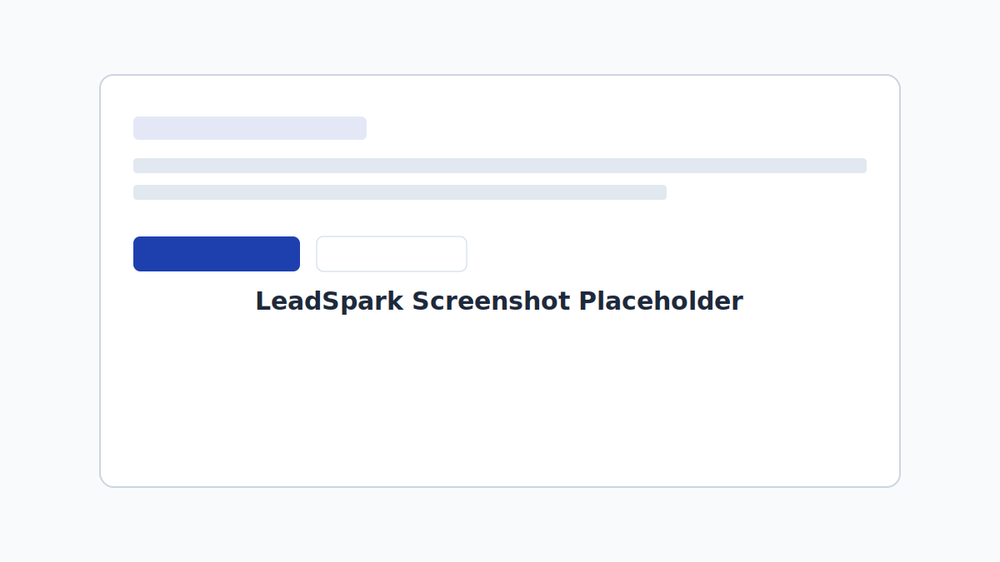

# LeadSpark

AI Speed-to-Lead SaaS for insurance agents.

## Features

- AI-powered first response in ~60 seconds after lead intake
- Lead qualification scoring with reason summaries
- Agent dashboard for lead pipeline tracking
- Public branded intake form per agent slug
- Authentication and protected lead management routes
- Notifications/integrations support through backend services

## Screenshot



## Tech Stack

- Next.js 14 (App Router)
- React 18 + TypeScript
- Tailwind CSS
- shadcn/ui primitives
- Supabase (Auth + Postgres)
- lucide-react icons

## Getting Started

1. Clone the repository.

```bash
git clone https://github.com/your-org/leadspark.git
cd leadspark
```

2. Install dependencies.

```bash
npm install
```

3. Configure environment variables.

```bash
cp .env.example .env.local
```

Set the required values (Supabase URL/keys, AI provider key, notification integration tokens).

4. Run Supabase migration.

Use your preferred Supabase workflow to apply:

- `supabase/migrations/0001_init.sql`

5. Start development server.

```bash
npm run dev
```

Open `http://localhost:3000`.

## Deploy to Vercel

1. Push your repo to GitHub/GitLab/Bitbucket.
2. Import the project in Vercel.
3. Add all environment variables from `.env.local` in Vercel Project Settings.
4. Ensure Supabase database migration is applied.
5. Deploy.

## API Documentation Summary

- `POST /api/auth/signup`: create agent account and profile
- `POST /api/auth/login`: authenticate and return Supabase session tokens
- `GET /api/leads`: list authenticated agent leads
- `GET /api/leads/[id]`: fetch one lead for authenticated agent
- `PATCH /api/leads/[id]`: update lead `status` and `notes`
- `GET /api/agents/[slug]`: fetch public agent profile for hosted intake form
- `POST /api/leads/intake`: public lead intake endpoint with AI qualification

## License

MIT
